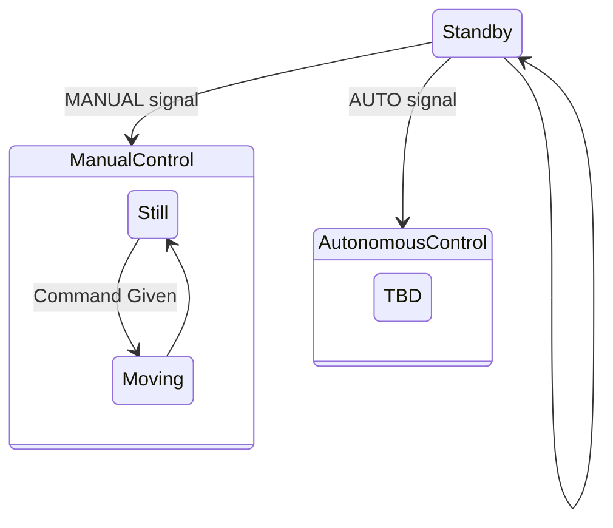
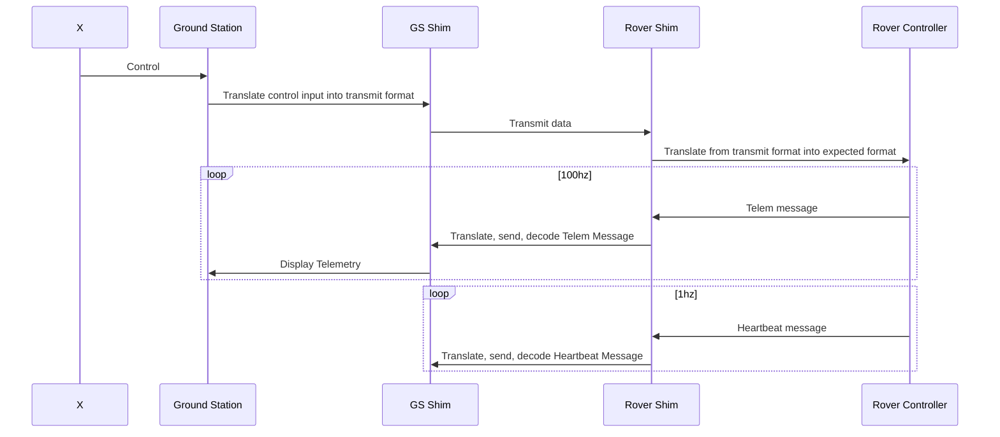

# Rover MonoRepo

This repository contains C++ code to control the raspberry pi alongside homebase code written in Node.js. The code in this repository will allow your computer to communicate with and control the raspberry pi and all attached sensors and motors. 

## Design Principles

This is a learning project, so I will be making all of the communications protocols myself. All communication will be done with short messages, separated by type (Telemetry, control, heartbeat, etc.). Communication method between control station and rover should not matter. There will be shims on either side of the communications code that will encode and decode data accordingly. This way, comms methods can be swapped easily. 

To start, communications will be done over wifi. However, like I said the method does not matter. Theoretically, the rover is always a 'server' and the ground station is always a 'client'. The ground station establishes a connection with the rover, allowing the rover's state to change. The rover is a large state machine:



While in the Standby state, the rover will have motors OFF and consistently listening for a state change command. Any non-state change command given will be ignored.

When the state is changed to MANUAL, control inputs will be accepted. These inputs come in the form of short messages: `LEFT:[0-100],RIGHT:[0-100]`. These correlate to each tank tread. A state change back to Standby will kill the motors.

Telemetry will be sent during all states. This telemetry will be sent as short messages with raw data:

```
GYRO::gx:INT,gy:INT;US:INT;NMEA:STRING
```

Here semi-colons separate data type, double colons indicate multiple pieces of data for this set following, single colon indicates value folowing. Commas separate pieces of data within a set. Ultrasonic data will always be sent in centimeters.

The workflow of communication will be the following:



In the earliest implementation, the shim layer will be a TCP/UDP connection between the rover and ground station. 

## rapsberry-pi

This directory contains all source code for the robot. 

This code is compiled on the raspberry-pi. Compiling on a non pi device will cause problems. Copy the file structure within `raspberry-pi/` onto your pi, go to the code's working directory, and run:

```
sudo apt-get update
sudo apt-get install wiringpi libi2c-dev build-essential cmake
```

```
rm -rf build && mkdir build && cd build
cmake ..
cmake --build .
```

## home-base

This directory contains all source code for the control station. 