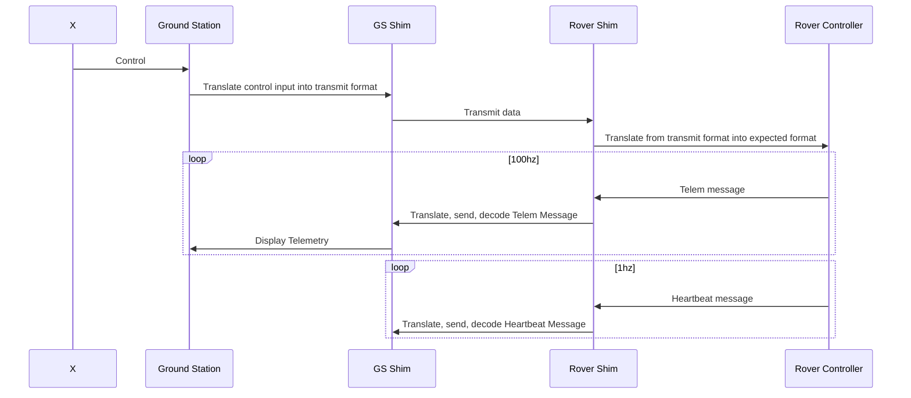
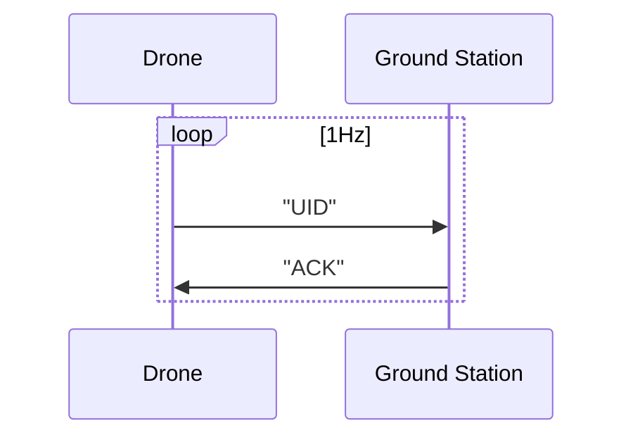

# Communication Structure

Communcation is done through a METHOD, while the content of the communication is determined by the STANDARD. Translating standardized messages to and from Method format is the job of the Shim layer on either side of the comms link. An example of this is below:



In the earliest implementation, the shim layer will be a TCP/UDP connection between the rover and ground station. 

There will be TWO consistent communications: Telemetry and the heartbeat. 

1. Telemetry is shared at 100hz and is always on
   1. Meant to share data from drone to ground station
2. Heartbeat is shared at 1hz and is always on
   1. meant to track all drones connected to ground station

Additionally, all drones will have a unique ID on the network that is determined based on when they connected to the ground station. It is generated by the ground station and given to the drone during initial setup/negotiation. This UID will prepend every message sent by each drone. 


## Telemetry

Telemetry will be sent during all states. This telemetry will be sent as short messages with raw data:

```
UID|GYRO::gx:INT,gy:INT;US:INT;NMEA:STRING
```

The UID is prepended to the message, followed by a pipe, indicating data following. 

Here semi-colons separate data type, double colons indicate multiple pieces of data for this set following, single colon indicates value folowing. Commas separate pieces of data within a set. Ultrasonic data will always be sent in centimeters.

Telemetry data requires no response and is sent at a fixed Telemetry transfer rate. The rover considers telemetry to be 'fire and forget'. 

## Heartbeat

The heartbeat is a super simple, 1hz message that contains the drone UID. It is sent from the drone to the ground station and has a simple `ACK` response. This serves two purposes:

1. Track and know how many drones are connected to the ground station at any point in time
2. Handle loss of connection near immediately

The amount of heartbeats needed before the connection is considered lost is variable. 



## State Machine Implications

Communication is done on top of the state machine but still may affect it. If the ground station misses 5 heartbeats or the drone misses 5 'ACK's, communication is considered lost and the rover enteres STANDBY state.