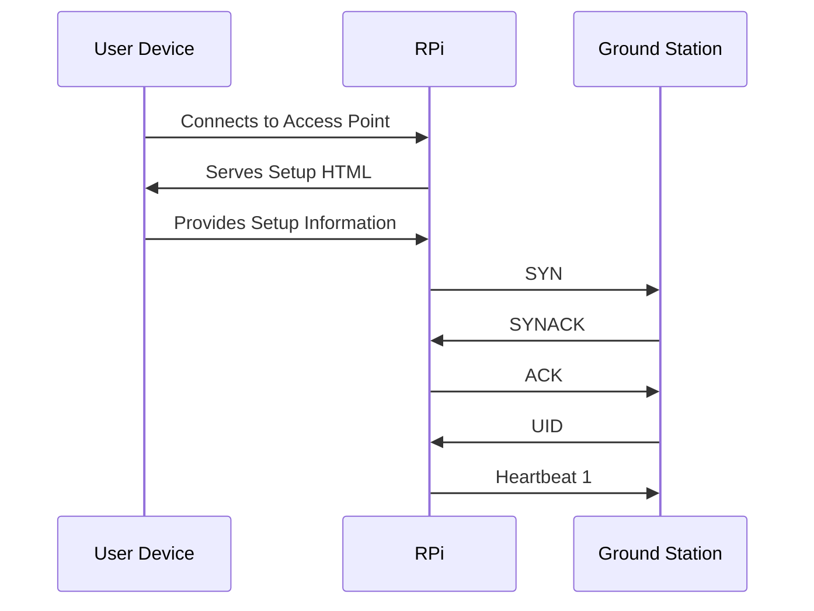
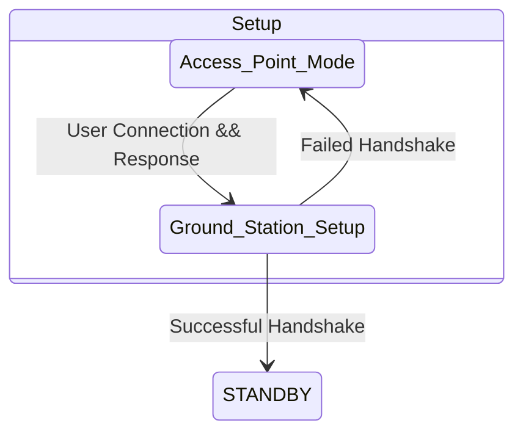

# Initial Drone Setup

There will need to be an initial connection made between the drone and the ground station.

Initial Setup is done BEFORE anything else is done on the drone. Once the drone is set up and connected to the ground station, explicit steps must be taken to reset it if setup must be done again.

## What Does Setup Do?

1. Defines communications METHOD for drone
   1. If METHOD is WiFi, this gives the drone the required wifi information
2. Defines Ground Station information 
   1. If METHOD is WiFi, give IP address

## How Does Setup Work?

When the RPI code first starts running, it will configure the Pi as an access point. Currently, the access point will be simply encrypted with `password` as the password, but eventually that will be configurable. The user will connect to the access point and it will serve a very simple html page that asks for the required information. 

After the information is given to the Pi, it will attempt to connect to the Ground station over the given comms METHOD. If successful, it will disable its access point and begin setup configuration with the ground station.

## Setup Configuration with Ground Station

After initial connection with the Ground Station is made, the final steps of the setup process take place. These final steps entail a starting SYN/SYNACK/ACK handshake is made between the pi and ground station. Based on architecture, the Pi is the 'server' and the ground station is the 'client', so the Pi sends SYN, the ground station responds SYNACK, the Pi responds ACK. This establishes connection between the ground station and the drone, and after a successful handshake a UID will be created and sent to the drone. So this handshake becomes SYN/SYNACK/ACK/UID. Once the UID is established, the last step of setup is the kickoff of heartbeat messages. 

## Reset Process

There will be a button physically on the robot that allows for reset. When held for three seconds or longer, the RPi will revert to pre-setup state and become an access point again. 

## Setup State Diagram

