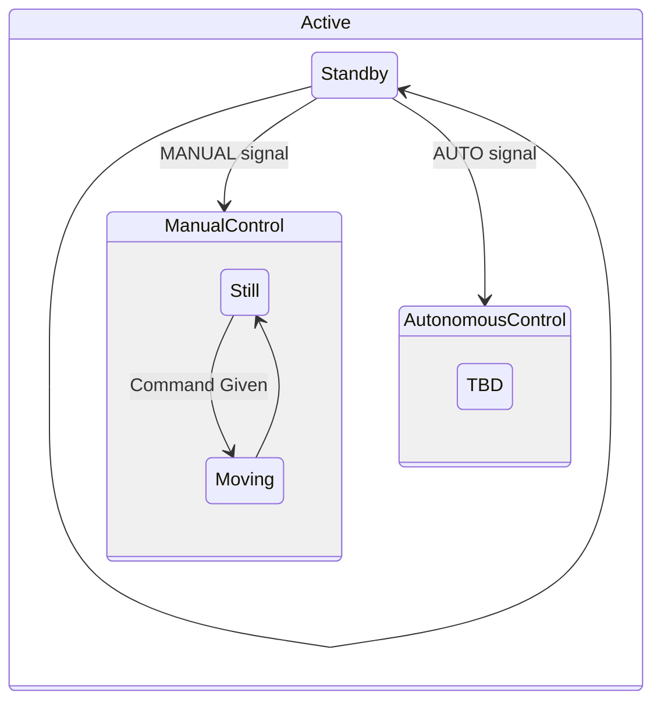

# Manual Control

While in the Standby state, the rover will have motors OFF and consistently listening for a state change command. Any non-state change command given will be ignored.

When the state is changed to MANUAL, control inputs will be accepted. These inputs come in the form of short messages: `LEFT:[0-100],RIGHT:[0-100]`. These correlate to each tank tread. A state change back to Standby will kill the motors.
