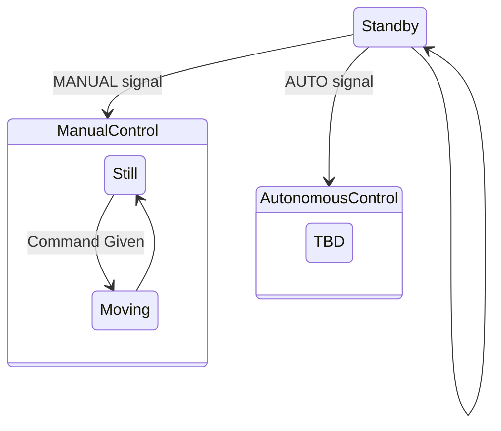

# State Machine Design

This is a learning project, so I will be making all of the communications protocols myself. All communication will be done with short messages, separated by type (Telemetry, control, heartbeat, etc.). Communication method between control station and rover should not matter. There will be shims on either side of the communications code that will encode and decode data accordingly. This way, comms methods can be swapped easily. 

To start, communications will be done over wifi. However, like I said the method does not matter. Theoretically, the rover is always a 'server' and the ground station is always a 'client'. The ground station establishes a connection with the rover, allowing the rover's state to change. The rover is a large state machine:

While in the Standby state, the rover will have motors OFF and consistently listening for a state change command. Any non-state change command given will be ignored.

When the state is changed to MANUAL, control inputs will be accepted. These inputs come in the form of short messages: `LEFT:[0-100],RIGHT:[0-100]`. These correlate to each tank tread. A state change back to Standby will kill the motors.
