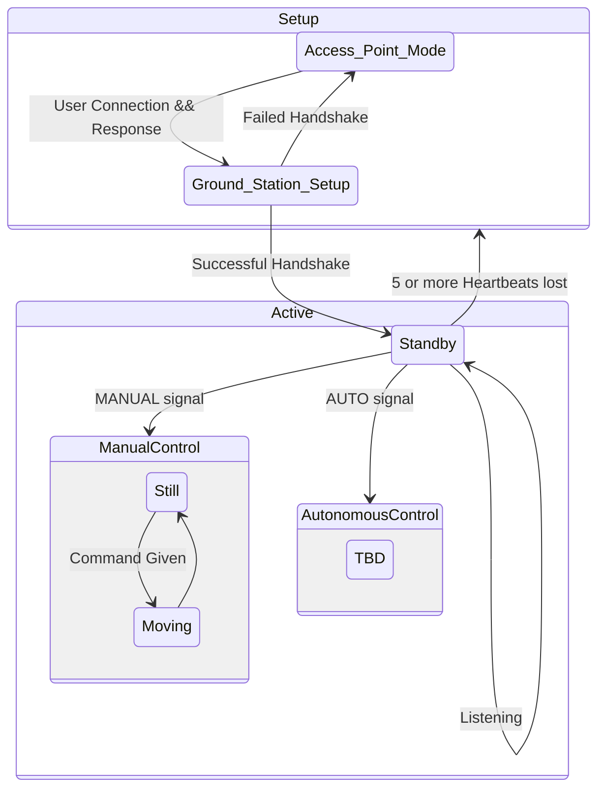

# State Machine Design

The rover is a large state machine, and the state it's in at any time drive behavior. There are many states, most having substates. The individual state diagrams can be found in their respective docs, but the point of this document is the entire state machine of the rover. 

