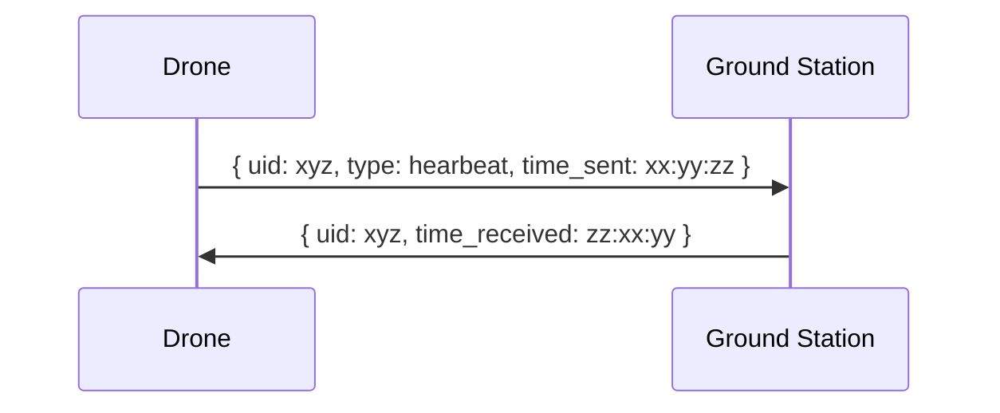

# Raspberry Pi Rover

Code meant to control a small rover (6" wheels) from a Raspberry Pi. The rover has the following sensors:

- Camera (rpi camera)
- Ultrasonic ()
- IMU (MPU 6050)
- GPS (Goouuu GT-U7)

Code will be written in C++ and control all of the above sensors as well as the motors. 

The Rover will use a Tank Drive system utilizing two 1000kV brushless motors geared up at a 5:1 ratio. These motors will drive a belt that drives the wheels. Prioritizing torque, this robot will be small and slow but very capable of travelling in a hilly urban environment. 

## Communication

Initially communication done with the rover will happen over wifi. The rpi and the controlling unit will both be on the same network and communicating with UDP. 

Over time, communication will move to dedicated SDR comms. 

### Heartbeats

Once a second (1Hz) a heartbeat message will be sent by the drone to the ground station, and the ground station will acknowledge it has been received. The heartbeat will contain the drone's unique ID and the time sent. The ground station will respond back with the UID and the time received. 

